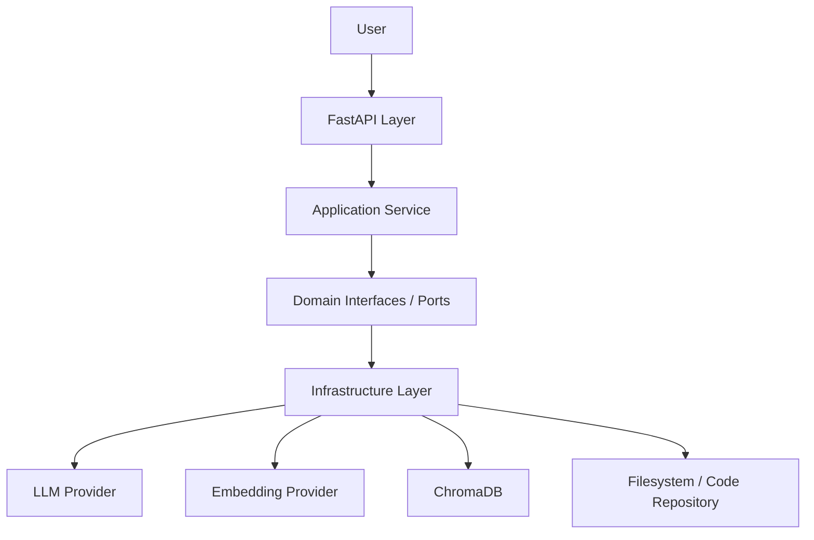
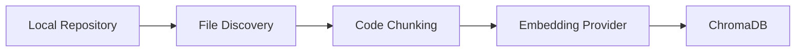

# AI SWE Agent

**A production-oriented AI Software Engineer Agent, built incrementally on a clean, provider-independent architecture.**

---

## Overview

**AI SWE Agent** is an AI system designed to understand and work with real software codebases. The long-term goal is an agent that can inspect a repository, retrieve the code relevant to a question or task, reason about it using an LLM, and eventually take actions — searching code, explaining it, finding bugs, generating tests, and more.

This is not a wrapper around a single LLM call. It is a layered system where the LLM is one component among several — retrieval, indexing, and domain modeling are treated as first-class engineering concerns, not afterthoughts.

## Why This Project Exists

Most "AI coding assistant" demos are a single script that stuffs a prompt into an LLM. That approach breaks down quickly:

- It cannot reason about a codebase larger than the LLM's context window.
- It has no way to retrieve *only* the relevant code for a given question.
- It hard-codes a specific LLM provider, making it brittle and hard to evolve.
- It has no clear boundary between "business logic" and "which AI SDK we happen to be calling."

This project exists to build the AI SWE Agent the way a real engineering team would: with clear interfaces, a retrieval pipeline that scales past a single prompt, and an architecture that lets each piece evolve independently.

## Architecture

The project follows a **layered architecture with strict separation of concerns**, inspired by Clean Architecture / Ports & Adapters. Dependencies point inward: business logic depends on abstractions, never on concrete SDKs or frameworks.



- **`api/`** — FastAPI routers. Translates HTTP requests into calls on application services. No business logic lives here.
- **`domain/`** — entities (e.g. `CodeChunk`) and protocol-based interfaces (`ports`) that define *what* the system needs (an LLM, a vector store, a code repository) without saying *how*. This layer has no dependency on any specific SDK.
- **`application/`** — services and (eventually) agents that orchestrate domain interfaces to fulfill a use case, such as answering a chat message.
- **`infrastructure/`** — concrete implementations of the domain ports: the OpenRouter-backed LLM client, the embedding provider, the ChromaDB vector store, the local filesystem code repository.

Dependency injection wires concrete infrastructure implementations into application services at startup, so the application layer only ever depends on protocols.

## Core Pipeline

### LLM Abstraction

The LLM is deliberately abstracted behind a protocol rather than called directly, so the application layer never depends on a specific provider's SDK:

```text
API → ChatService → LLM Protocol ← OpenRouterLLM → OpenAI-compatible SDK → OpenRouter → LLM
```

The current implementation talks to **OpenRouter** through an OpenAI-compatible interface, but because the application layer only knows about the `LLM` protocol, the underlying provider can be swapped by writing a new adapter — no changes to application logic required.

### Codebase Understanding Pipeline

The system is being built toward a retrieval-augmented pipeline so that the LLM reasons over *relevant* code, not the entire repository crammed into a prompt.

**Indexing** (repository → searchable vectors):



**Retrieval** (question → grounded answer):


The roles in this pipeline:

- **The LLM** is responsible for reasoning and generation — explaining, summarizing, answering, suggesting — given the context it's handed.
- **Embeddings** convert code and text into numerical vectors that capture semantic meaning, so that "similar meaning" can be computed mathematically rather than by keyword matching.
- **ChromaDB** acts as the semantic index: it stores those vectors and retrieves the closest matches to a query.
- **Chunking** exists because a repository is almost always larger than an LLM's context window; splitting it into smaller, retrievable units is what makes retrieval-augmented generation possible at all.
- **Retrieval** is the step that connects a question to the specific pieces of code relevant to it, so the LLM reasons over a focused, relevant slice of the codebase rather than everything at once.

## Codebase Repository

Code access is abstracted behind a protocol rather than scattered `open()` calls:

```python
class CodeRepository(Protocol):
    def list_files(self) -> list[str]: ...
    def read_file(self, path: str) -> str: ...
```

The local implementation:

- recursively discovers files in a repository
- ignores non-source directories such as `.git`, `.venv`, `__pycache__`, `node_modules`
- only processes recognized source/documentation file extensions
- reads files safely and validates UTF-8 text
- prevents path traversal outside the repository root

This exists so that "read a codebase" is a well-defined, safe operation the rest of the system can rely on — not an ad-hoc filesystem walk repeated in multiple places.

## Code Chunking

Large files and repositories cannot be sent to an LLM or embedded as a single unit, so code is split into smaller chunks before indexing.

Current strategy: **line-based chunking**.

- Chunk size: 40 lines
- Overlap: 5 lines

The overlap exists so that logic spanning a chunk boundary — a function definition split across two chunks, for instance — isn't silently cut in a way that destroys its meaning. Some context carries over between adjacent chunks.

This is an initial implementation. Line-based chunking is simple but not aware of code structure. Future iterations may use:

- token-aware chunking (respecting model context limits precisely)
- syntax-aware chunking
- AST-based chunking (splitting along function/class boundaries)
- language-specific chunking strategies

None of the above are implemented yet — line-based chunking is what exists today.

## Vector Database

A vector database is required because semantic search — "find code related to this question" — cannot be done with keyword search alone; it requires comparing meaning, not text.

The flow:

```text
Code:
"def authenticate_user(): ..."
        ↓ embedding
[0.12, -0.43, 0.81, ...]
```

Each code chunk is embedded into a vector and stored in ChromaDB alongside metadata (e.g. file path, chunk position), so a retrieved vector can be traced back to its source location. A user's question is embedded the same way, and ChromaDB's similarity search finds the stored vectors closest to the query vector — i.e., the code most semantically related to the question.

**Indexing** (writing embeddings into the store) is deliberately separate from **querying** (reading from it): indexing happens when a repository is processed, querying happens on every user question. Keeping these separate means the (relatively expensive) indexing step doesn't have to be repeated on every request.

## Current Project Status

### Implemented

- FastAPI application foundation
- Health endpoint
- LLM chat endpoint
- Dependency injection wiring
- LLM provider abstraction (protocol-based)
- OpenRouter integration via OpenAI-compatible SDK
- Safe local code repository (file discovery, filtering, path-traversal protection)
- Code chunking (line-based, with overlap)
- `CodeChunk` domain model
- Embedding abstraction (protocol-based)
- Embedding provider (OpenRouter)
- ChromaDB vector-store architecture

### In Progress / Next

- Full codebase indexing pipeline (end-to-end repository → ChromaDB)
- Persisting code embeddings into ChromaDB
- Semantic code retrieval
- Retrieval-Augmented Generation (RAG), connecting retrieved code to the LLM
- Improved code-aware retrieval

### Planned

- Agent / tool architecture
- Code search tools
- Repository inspection tools
- File modification tools
- Test execution tools
- Git integration
- Agent planning and multi-step reasoning workflows
- LangGraph (or similar) orchestration
- AST-aware code understanding
- Incremental indexing and repository change detection
- Retrieval reranking
- Automated code analysis
- Production deployment

## Technology Stack

| Technology | Role |
|---|---|
| **Python** | Core implementation language |
| **FastAPI** | HTTP API layer, async request handling, OpenAPI docs |
| **Pydantic / Pydantic Settings** | Data validation and typed, environment-driven configuration |
| **OpenAI Python SDK** | Client used against OpenAI-compatible endpoints |
| **OpenRouter** | Current LLM and embedding provider, accessed via the OpenAI-compatible interface |
| **ChromaDB** | Vector store for semantic code retrieval |
| **Git** | Version control |
| **Pytest** | Test framework (testing is ongoing as functionality lands) |

## Engineering Decisions

**Why protocols/interfaces?** So application logic depends on *what* a component does (e.g. "generate a completion"), not on *how* a specific vendor's SDK is shaped. This makes providers swappable and components independently testable with fakes.

**Why separate domain / application / infrastructure?** So that business rules (how a question gets answered) don't get entangled with implementation details (which HTTP client talks to which vendor). Each layer can change without rippling into the others.

**Why abstract the LLM provider?** LLM providers, pricing, and capabilities change quickly. An abstraction means adopting a new provider is a new adapter, not a rewrite.

**Why dependency injection?** Concrete implementations (the OpenRouter client, the ChromaDB store) are constructed once and handed to services that depend only on protocols — this is what makes the provider swap above actually possible in practice, and what makes services testable with mocks.

**Why a vector store?** Because relevance in code isn't about matching keywords — it's about matching meaning. A vector store is what makes "find the code relevant to this question" tractable at repository scale.

**Why chunk the codebase?** Because no LLM context window fits an entire non-trivial repository, and embeddings work better over focused units of meaning than over huge blocks of unrelated code.

**Why separate indexing from retrieval?** Indexing (embedding and storing a repository) is comparatively expensive and only needs to happen when code changes. Retrieval (a similarity search) needs to be fast and happens on every query. Conflating them would make every question re-index the whole repository.

**Why protect filesystem access?** An agent that reads arbitrary paths on request is a security liability. Restricting reads to the repository root and validating inputs is a baseline requirement, not an optional hardening step.

**Why keep provider-specific code outside the domain layer?** So the core logic of "what does this system do" stays readable and stable even as specific vendors, SDKs, and libraries around it change.

## Project Structure

```text
ai-swe-agent/
├── app/
│   ├── api/
│   │   ├── v1/
│   │   │   ├── health.py
│   │   │   ├── chat.py
│   │   │   └── codebase.py
│   │   └── deps.py
│   │
│   ├── core/
│   │   ├── config.py
│   │   ├── logging.py
│   │   └── exceptions.py
│   │
│   ├── domain/
│   │   ├── entities/
│   │   └── ports/
│   │
│   ├── application/
│   │   ├── agents/
│   │   └── services/
│   │
│   ├── infrastructure/
│   │   ├── llm/
│   │   ├── vectorstore/
│   │   └── filesystem/
│   │
│   └── main.py
│
├── tests/
│   ├── unit/
│   └── integration/
│
├── pyproject.toml
├── .env.example
└── README.md
```

## Configuration

Configuration is environment-variable driven and validated at startup. Key variables:

```env
APP_NAME
ENVIRONMENT
LOG_LEVEL
LLM_API_KEY
LLM_BASE_URL
LLM_MODEL
EMBEDDING_MODEL
CHROMA_PERSIST_DIR
```

`.env` is intentionally excluded from version control (see `.gitignore`) — copy `.env.example` to `.env` locally and fill in real values, which should never be committed.

## Setup / Running

```bash
git clone <your-repo-url>
cd ai-swe-agent

python -m venv .venv
source .venv/bin/activate      # Windows: .venv\Scripts\activate

pip install -e ".[dev]"

cp .env.example .env
# edit .env with your LLM_API_KEY, LLM_BASE_URL, etc.

python -m uvicorn app.main:app --reload
```

Once running, the interactive API docs (Swagger/OpenAPI) are available at `/docs` for exploring and trying endpoints directly.

## API

Currently meaningful endpoints:

```text
GET  /api/v1/health
POST /api/v1/chat
```

Example `/api/v1/chat` request:

```json
{
  "message": "What does the authenticate_user function do?"
}
```

Example response:

```json
{
  "response": "..."
}
```

Full request/response schemas are available via the auto-generated docs at `/docs`.

## Limitations

- Retrieval is not yet wired end-to-end — indexing and querying exist as architecture, not yet as a complete, connected pipeline.
- Chunking is line-based and not aware of code structure; a chunk can split a function awkwardly.
- No agent/tool-use loop exists yet — the system does not yet take autonomous multi-step actions on a codebase.
- No reranking, incremental indexing, or change detection yet — indexing is not optimized for repositories that change frequently.
- No authentication, rate limiting, or deployment hardening yet — this is a development-stage project.

## Project Philosophy

This project is intentionally built incrementally — one reviewed, working piece at a time — rather than as a single large agent script. The guiding principles:

- separation of concerns
- testability
- provider independence
- explicit abstractions over implicit assumptions
- secure-by-default filesystem access
- modularity
- replaceable infrastructure
- incremental, milestone-based development
- production-oriented architecture from the start, even while functionality is still partial

## Contributing / Development Notes

This is an actively developed solo project. Working conventions:

- `domain/` and `application/` must never import from `infrastructure/` or `api/`.
- Every infrastructure adapter implements a protocol defined in `domain/ports/`.
- New capabilities are expected to land with tests, not just working demos.